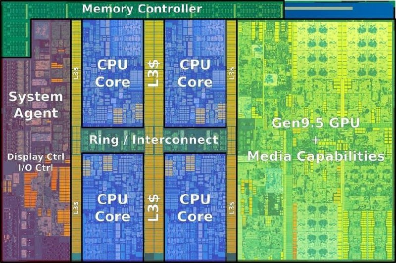
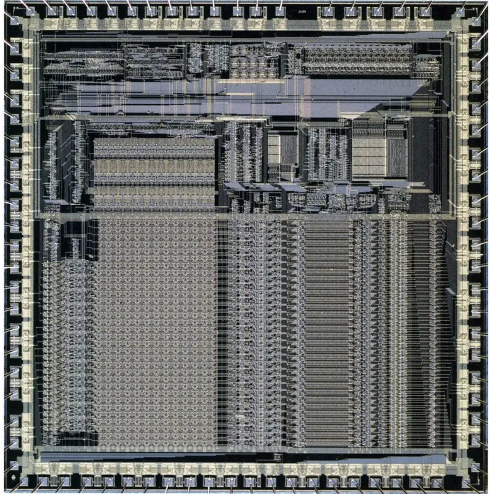

# Linux Scheduling

ℹ️ ***Примечание**: Данное исследованние представляет собой лишь вводный обзор обширной темы, связанной с планированием процессов в Linux. В ней приведены основные концепции и результаты ряда экспериментов, направленных на изучение взаимодействия с операционной системой. Для более глубокого понимания вопроса рекомендуется ознакомиться с дополнительными источниками и литературой, так как тема требует более детального изучения и анализа.*

## Ведение

### Закон Мура (моральное отступление)

  

Вы, вероятно, уже видели этот график, иллюстрирующий закон Мура. Этот закон гласит, что количество транзисторов на интегральной схеме удваивается примерно каждые два года, что приводит к значительному увеличению вычислительной мощности. Однако в последние годы наблюдается ситуация, когда, несмотря на рост числа транзисторов, скорость их работы не увеличивается с той же динамикой.

📚*Для более подробного изучения данной темы рекомендую ознакомиться с [этой статьей на Хабре](https://habr.com/ru/companies/droider/articles/568806/)*

### Современный процессор



Современные процессоры обладают множеством ядер, что частично решает проблему параллельного выполнения задач. Однако речь идет не только об этом. Заметим, что вычислительных модулей всего несколько, а на нашем компьютере одновременно запускается множество процессов. 

Стоит также взглянуть на:



ARM1, выпущенный в 1985 году, вовсе не поддерживал многоядерность. Так каким же образом множество процессов исполняются одновременно? 

В этом помогает **планировщик (Scheduler)**, который управляет распределением процессорного времени между активными процессами. Он обеспечивает эффективное использование ресурсов, позволяя системе обрабатывать несколько задач одновременно, даже на одноядерных процессорах.

## Что же такое процесс?

Процесс в Linux — это основная единица выполнения, представляющая собой программу, которая находится в состоянии выполнения. Каждый процесс имеет свою собственную область памяти, ресурсы и состояние, что позволяет операционной системе управлять многозадачностью и эффективно распределять ресурсы.

📚*Подробнее о процессах в Linux можно прочитать [здесь](https://habr.com/ru/articles/423049/)*
📺*О технических деталях (переключение контекста, PCB, адресное пространство) можно посмотреть [здесь](https://www.youtube.com/watch?v=LDhoD4IVElk&t=5s)*

### PCB (Process Control Block)

Каждый процесс в Linux представлен структурой данных, называемой PCB (Process Control Block), которая в Linux реализована через структуру `task_struct`. Эта структура содержит всю необходимую информацию о процессе, включая:

- **Идентификатор процесса (PID)**: уникальный номер, присваиваемый каждому процессу.
- **Состояние процесса**: информация о том, выполняется ли процесс, ожидает ли он ресурсов или завершен.
- **Приоритет**: значение, определяющее, насколько важен процесс по сравнению с другими.
- **Указатели на родительский и дочерние процессы**: для управления иерархией процессов.
- **Ресурсы**: информация о выделенной памяти, открытых файлах и других системных ресурсах.


📚*С официальной реализацией структуры `task_struct` вы можете ознакомиться [здесь](https://github.com/torvalds/linux/blob/master/include/linux/sched.h)*

```c
struct task_struct {
#ifdef CONFIG_THREAD_INFO_IN_TASK
	/*
	 * For reasons of header soup (see current_thread_info()), this
	 * must be the first element of task_struct.
	 */
	struct thread_info		thread_info;
#endif
	unsigned int			__state;

	/* saved state for "spinlock sleepers" */
	unsigned int			saved_state;

	/*
	 * This begins the randomizable portion of task_struct. Only
	 * scheduling-critical items should be added above here.
	 */
	randomized_struct_fields_start

	void				*stack;
	refcount_t			usage;
	/* Per task flags (PF_*), defined further below: */
	unsigned int			flags;
	unsigned int			ptrace;
    ...
```

## Планировщик (Scheduler)

### Цели планировщика

Планировщик (Scheduler) в операционной системе выполняет несколько ключевых задач:

1. **Максимизация использования процессора**  
2. **Справедливое распределение ресурсов**  
3. **Минимизация времени отклика**  
4. **Управление приоритетами**  

## Приоритеты

### Как планировщик выбирает следующую задачу?

В Linux, как и в любой современной ОС, существует система приоритетов, определяющая порядок выполнения задач. Это базовая абстракция, поверх которой работают конкретные механизмы планирования.

### RTPRIO, NI и PRI:

#### Исходные данные
Для исследования используем вывод утилиты `ps`:
```
➜  priorities ps -eo pid,rtprio,ni,pri,policy,cmd

    PID RTPRIO  NI PRI POL CMD
      1      -   0  19 TS  /sbin/init splash
      2      -   0  19 TS  [kthreadd]
      3      -   0  19 TS  [pool_workqueue_release]
      4      - -20  39 TS  [kworker/R-rcu_gp]
      5      - -20  39 TS  [kworker/R-sync_wq]
      6      - -20  39 TS  [kworker/R-slub_flushwq]
      7      - -20  39 TS  [kworker/R-netns]
     10      - -20  39 TS  [kworker/0:0H-events_highpri]
     12      - -20  39 TS  [kworker/R-mm_percpu_wq]
     13      -   0  19 TS  [rcu_tasks_kthread]
     14      -   0  19 TS  [rcu_tasks_rude_kthread]
     15      -   0  19 TS  [rcu_tasks_trace_kthread]
     16      -   0  19 TS  [ksoftirqd/0]
     17      -   0  19 TS  [rcu_preempt]
     18      -   0  19 TS  [rcu_exp_par_gp_kthread_worker/0]
     19      -   0  19 TS  [rcu_exp_gp_kthread_worker]
     20     99   - 139 FF  [migration/0]
     21     50   -  90 FF  [idle_inject/0]
     22      -   0  19 TS  [cpuhp/0]
     23      -   0  19 TS  [cpuhp/1]
     24     50   -  90 FF  [idle_inject/1]
     25     99   - 139 FF  [migration/1]
     ... [output omitted] ...
```
Каждый процесс имеет только одно из двух значений: RTPRIO или NI, при этом каждый обладает значением PRI. Разберем, почему существует так много приоритетов и за что отвечает каждый из них.


#### Интерпретация полей (согласно `man ps`)
```
 rtprio      RTPRIO    realtime priority.
 ni          NI        nice value. This ranges from 19 (nicest) to -20 (not nice to others), see nice(1).  (alias nice).
 pri         PRI       priority of the process.  Higher number means higher priority.
```


#### 1. Приоритет реального времени (RTPRIO):

Параметр `rtprio` (realtime priority) определяет порядок выполнения процессов реального времени (RT) в Linux. Основные свойства:

- **Область применения**  
   Используется исключительно для политик:
   - `SCHED_FIFO` (FIFO-очередь)
   - `SCHED_RR` (Циклическое планирование)
   - `SCHED_DEADLINE` (По временным ограничениям)

- **Диапазон значений**  
   Допустимые значения: от 1 до 99, где:
   - 1 - минимальный приоритет
   - 99 - максимальный приоритет

- **Динамичность**  
   Может модифицироваться:
   - Ядром ОС
   - Модифицируется через:
     ```bash
     sudo chrt -f -p <priority> <pid>    ### SCHED_FIFO
     sudo chrt -r -p <priority> <pid>    ### SCHED_RR
     ```
     💡Эксперементы по использованию `chrt` можно изучить [***здесь***](./priorities/chrt_experements.md) 

- **Влияние на планирование**  
   Реализует строгое упорядочивание:
   ```math
   ∀(P₁,P₂) ∈ Процессы, rtprio(P₁) > rtprio(P₂) ⇒ P₁ ≻ P₂
   ```
   где ≻ означает безусловный приоритет в планировании


#### 2. Значение Nice (NI):

Параметр `nice` определяет относительный приоритет для обычных процессов (non-RT) в Linux. По сути является UAPI. Основные свойства:

- **Область применения**
   Используется для политик:
   - `SCHED_OTHER` (стандартное планирование)
   - `SCHED_BATCH` (пакетные задачи)
   - `SCHED_IDLE` (фоновые процессы)

- **Диапазон значений**
   Допустимые значения: от -20 до 19, где:
   - -20 - наивысший приоритет
   - 19 - наинизший приоритет

- **Статичность**
   - Не изменяется ядром ОС автоматически
   - Модифицируется через:
     ```bash
     nice -n <value> <command>
     renice -n <value> -p <pid>
     ```
     💡Эксперементы по использованию `nice` можно изучить [***здесь***](./priorities/nice_experements.md) 

- **Влияние на планирование**
   Определяет вес процесса в алгоритме CFS:
   ```math
   weight = 1024 × (1.25)^(-nice)
   ```
   Чем выше nice → меньше вес → меньше доля CPU


#### 3. Поле PRI:

Параметр `PRI` (отображаемый приоритет) - это устаревший артефакт, сохраняемый для обратной совместимости (раньше в системах до Linux 2.6 отобржал динамический приоритет). В дальнейшем он браться во внимание не будет. Основные свойства:

- **Область применения**  
   Отображается в утилитах (`top`, `ps`), но не используется планировщиком

- **Почему бесполезен**  
   - Не влияет на планирование  
   - Разные утилиты отображают его по-разному (вплоть до разных выводов у `ps -l` и `ps -o pri`)

- **Реализация в ядре [*kernel/sched/core.c*](https://github.com/torvalds/linux/blob/master/kernel/sched/core.c)**
```c
static inline int __task_prio(const struct task_struct *p)
{
	if (p->sched_class == &stop_sched_class) /* trumps deadline */
		return -2;

	if (p->dl_server)
		return -1; /* deadline */

	if (rt_or_dl_prio(p->prio))
		return p->prio; /* [-1, 99] */

	if (p->sched_class == &idle_sched_class)
		return MAX_RT_PRIO + NICE_WIDTH; /* 140 */

	if (task_on_scx(p))
		return MAX_RT_PRIO + MAX_NICE + 1; /* 120, squash ext */

	return MAX_RT_PRIO + MAX_NICE; /* 119, squash fair */
}
```

#### Итог:

Сведём вышеописанные механизмы приоритезации в сравнительную таблицу для наглядноcти:

|                          | Dynamic Priority                  | Static Priority                    |
|--------------------------|:---------------------------------:|:----------------------------------:|
| **Policy Type**          | real-time                         | non-real-time                      |
| **Scheduling Classes**   | SCHED_FIFO SCHED_RR               | SCHED_OTHER                        |
| **Priority Range**       | RTPRIO=[1, 99]                    | NI=[-20;19]                        |
| **Priority Meaning**     | High RTPRIO means high priority   | High NI means low priority         |


Для определения приоритетов и политики можно воспользоваться утилитой `ps` с командой:
```bash
ps -eo pid,rtprio,ni,pri,policy,cmd
```
Также можно использовать программную реализацию, представленную в файле [*`sched_pid_info.c`*](./priorities/sched_pid_info.c)


## Политики планирования

### Совместное (cooperative) и прерывающее (preemptive) планирование

Для начала рассмотрим 2 основных метода планирования.

#### Совместное планирование (cooperative)

Представим себе простой планировщик процессов, работающий по принципу FIFO (First In, First Out). 

При совместном планировании задача планировщика заключается в том, чтобы выделить процессору (CPU) ресурсы для выполнения очередного процесса и ожидать его завершения. Как только процесс завершает свою работу, он освобождает ресурсы, что позволяет следующему процессу в очереди получить доступ к CPU.
```
                 1                                      2                                      3
       Waiting        Done                    Waiting        Done                    Waiting        Done
      ┌───────┐     ┌───────┐                ┌───────┐     ┌───────┐                ┌───────┐     ┌───────┐
    ┌─│   *   │     |       |                │  P_2  │     |       |              ┌─│   *   │     |  P_1  |<─┐
    │ │  P_2  │     │       |                │  P_3  │     │       |              | │  P_3  │     │       |  |
    │ │  P_3  │     │       │                │  P_4  │     │       │              | │  P_4  │     │       │  |
    │ │  P_4  │     │       │                │  ...  │     │       │              | │  ...  │     │       │  |
    │ │  ...  │     │       │                │  ...  │     │       │              | │  ...  │     │       │  |
P_1 │ │  ...  │     │       │                │  ...  │     │       │          P_2 | │  ...  │     │       │  | P_1
    │ │  ...  │     │       │                │  ...  │     │       │              | │  ...  │     │       │  |
    │ └───────┘     └───────┘                └───────┘     └───────┘              | └───────┘     └───────┘  |
    │                                                                             |                          |
    │           CPU                                    CPU                        |           CPU            │
    │        ┌───────┐                              ┌───────┐                     |        ┌───────┐         │
    └───────>|       |                              |  P_1  |⏳                   └───────>|   *   |─────────┘
             └───────┘                              └───────┘                              └───────┘
```

Этот метод имеет свои преимущества и недостатки. С одной стороны, он прост в реализации и позволяет избежать контекстных переключений. С другой стороны, если один из процессов зависает или работает слишком долго, это может привести к блокировке других процессов, что вызовет зависание системы.
```
Will be stuck in this state:
                 2
       Waiting        Done
      ┌───────┐     ┌───────┐
      │  P_2  │     |       |
      │  P_3  │     │       |
      │  P_4  │     │       │
      │  ...  │     │       │
      │  ...  │     │       │
      │  ...  │     │       │
      │  ...  │     │       │
      └───────┘     └───────┘

                CPU
             ┌───────┐
             |  P_1  |♾️
             └───────┘
```
Ранее был проведен эксперемент, вызывающий такое состояние (см. [*chrt_experement.md "Эксперимент 4"*](./priorities/chrt_experements.md))

#### Прерывающее планирование (preemptive)

В отличие от совместного, прерывающее планирование позволяет планировщику прерывать выполнение текущего процесса, чтобы предоставить ресурсы другим процессам.
```
                 1                                      2                                      3
       Waiting        Done                    Waiting        Done                    Waiting        Done
      ┌───────┐     ┌───────┐                ┌───────┐     ┌───────┐                ┌───────┐     ┌───────┐
    ┌─│   *   │     |       |                │  P_2  │     |       |              ┌─│   *   │     |       |
    │ │  P_2  │     │       |                │  P_3  │     │       |              | │  P_3  │     │       |
    │ │  P_3  │     │       │                │  P_4  │     │       │              | │  P_4  │     │       │
    │ │  P_4  │     │       │                │  ...  │     │       │              | │   *   │<─┐  │       │
    │ │  ...  │     │       │                │  ...  │     │       │              | │  ...  │  │  │       │
P_1 │ │  ...  │     │       │                │  ...  │     │       │          P_2 | │  ...  │  │  │       │
    │ │  ...  │     │       │                │  ...  │     │       │              | │  ...  │  │  │       │
    │ └───────┘     └───────┘                └───────┘     └───────┘              | └───────┘  │  └───────┘
    │                                                                             |            └─────────────┐
    │           CPU                                    CPU                        |           CPU            | P_1
    │        ┌───────┐                              ┌───────┐                     |        ┌───────┐         │
    └───────>|       |                              |  P_1  |⏳(limited)          └───────>|   *   |─────────┘
             └───────┘                              └───────┘                              └───────┘
```

📚*Подробнее про разницу между прерывающим и совместным планированием можно прочитать [*здесь*](https://www.geeksforgeeks.org/difference-between-preemptive-and-cooperative-multitasking/)*  
📺*Подробнее про работу планировщика, пики CPU, диспетчера и прочую полезную информацию можно посмотреть [*здесь*](https://www.youtube.com/watch?v=O2tV9q6784k&t=52s)*

### Типы политик

На [*Linux Foundation*](https://wiki.linuxfoundation.org/realtime/documentation/technical_basics/sched_policy_prio/start) указано следующее:

Существует два основных типа политик планирования:

- **Обычные политики (Non real-time policies):**
  - `SCHED_OTHER`
  - `SCHED_BATCH`
  - `SCHED_IDLE`

- **Политики реального времени (Real-time policies):**
  - `SCHED_FIFO`
  - `SCHED_RR`
  - `SCHED_DEADLINE`

💡Эксперементы с политиками планирования можно изучить [***здесь***](./policies/policy_experiments.md) 
