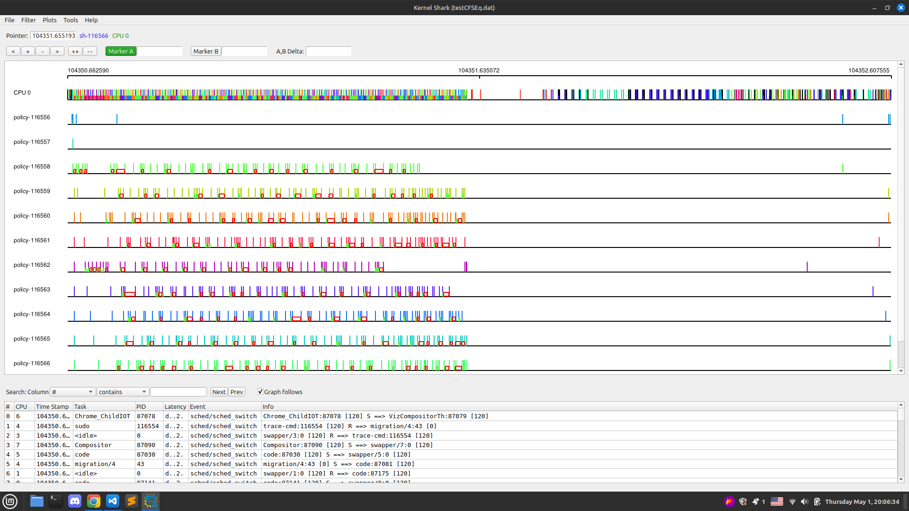
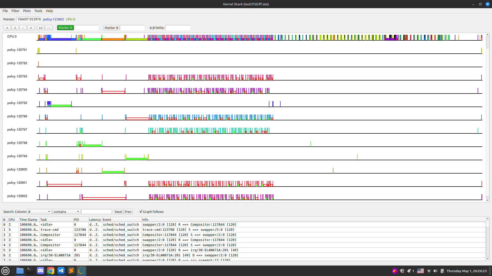
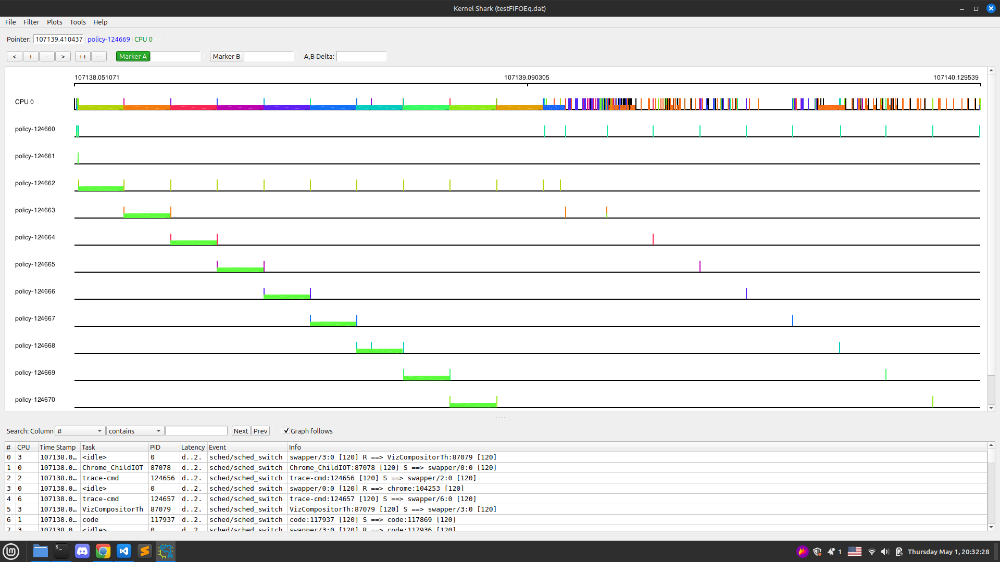
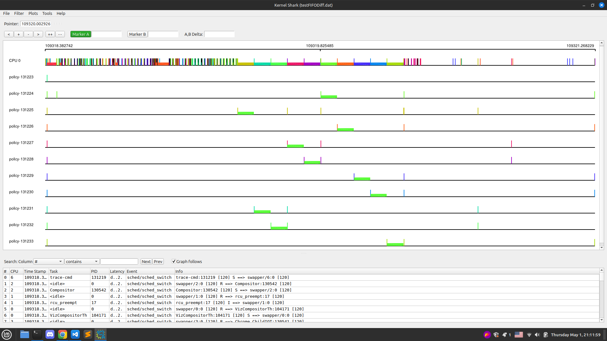
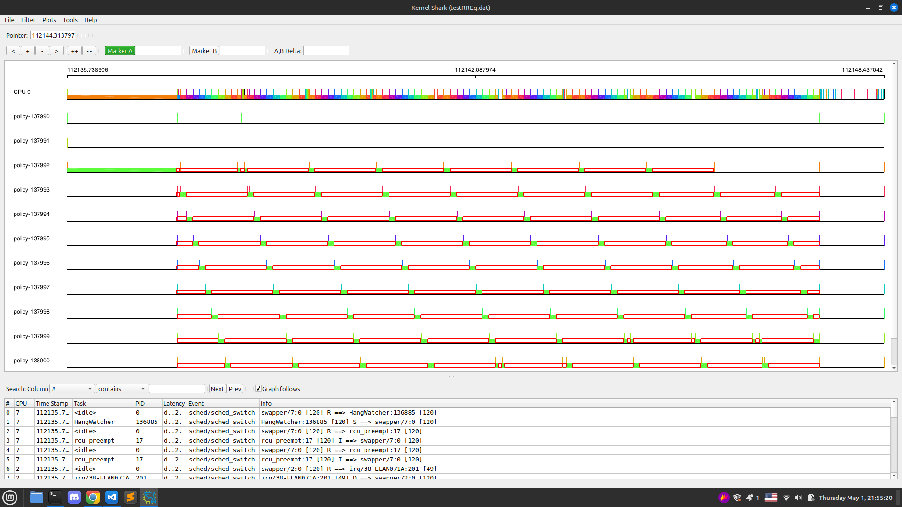
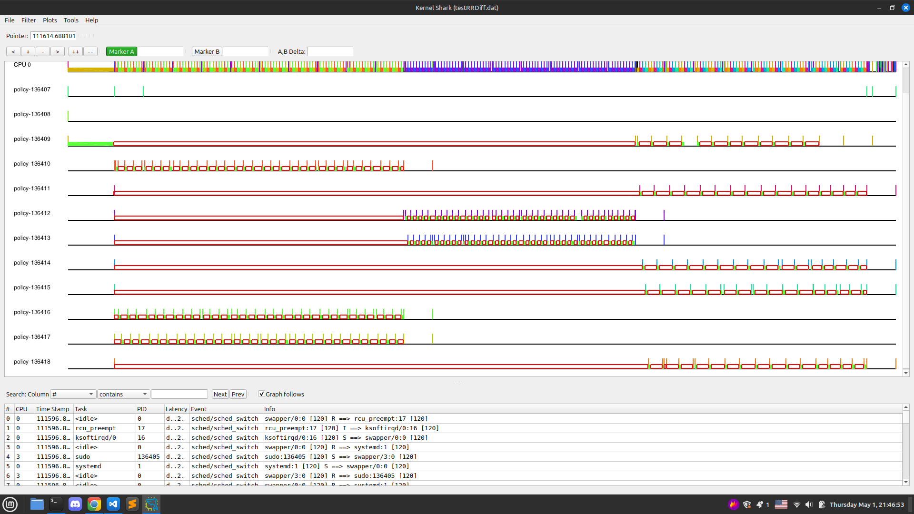
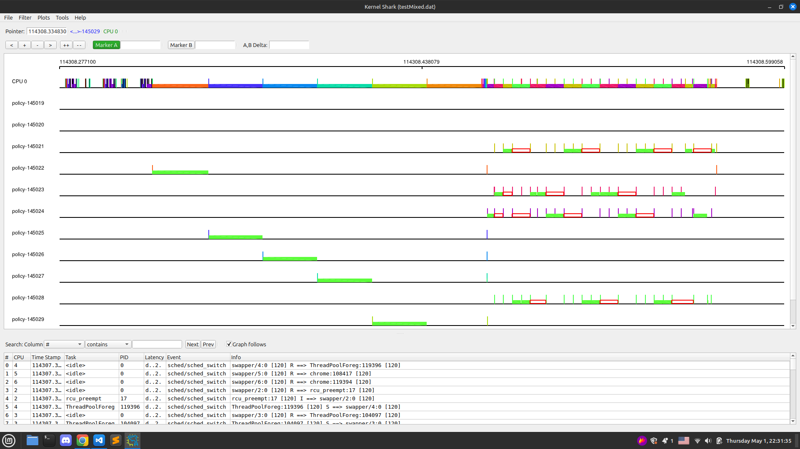

# Эксперименты с политиками планирования

ℹ️ ***Примечание**: Как уже упоминалось ранее, для планировщика нет различия между процессом и потоком, поскольку в ядре они представляют собой одну и ту же сущность — `task_struct`. В связи с этим для исследований будут использоваться потоки `pthread`, благодаря их удобству. Также все эксперименты будут проводиться на 1 ядре.*

## Знакомсто с инструментами трассировки:

Legacy вариант с использованием ftrace:
```bash
➜  policies sudo -s
➜  policies mkdir nodev
➜  policies sudo mount -t tracefs /sys/kernel/tracing nodev
```

Скрипт [*tracer.sh*](./tracer.sh) используется для установки одного из доступных трассировщиков (в данном примере — `function`). Скрипт запускает трассировку на протяжении 1 секунды, после чего выводит собранную информацию.
```bash
#!/bin/bash

echo function > nodev/current_tracer
echo 1 > nodev/tracing_on

sleep 1

less nodev/trace

echo nop > nodev/current_tracer
echo 0 > nodev/tracing_on
```

Результат работы:
```
# tracer: function
#
# entries-in-buffer/entries-written: 410078/3608198   #P:8
#
#                                _-----=> irqs-off/BH-disabled
#                               / _----=> need-resched
#                              | / _---=> hardirq/softirq
#                              || / _--=> preempt-depth
#                              ||| / _-=> migrate-disable
#                              |||| /     delay
#           TASK-PID     CPU#  |||||  TIMESTAMP  FUNCTION
#              | |         |   |||||     |         |
            Xorg-86340   [002] d..3. 94193.591209: _raw_spin_lock <-raw_spin_rq_lock_nested
            Xorg-86340   [002] d..3. 94193.591209: update_rq_clock <-__schedule
            Xorg-86340   [002] d..3. 94193.591209: dequeue_task <-__schedule
            Xorg-86340   [002] d..3. 94193.591210: dequeue_task_fair <-dequeue_task
            Xorg-86340   [002] d..3. 94193.591210: dequeue_entity <-dequeue_task_fair
            Xorg-86340   [002] d..3. 94193.591210: update_curr <-dequeue_entity
            Xorg-86340   [002] d..3. 94193.591210: update_curr_se <-update_curr
            Xorg-86340   [002] d..3. 94193.591210: update_min_vruntime <-update_curr
            Xorg-86340   [002] d..3. 94193.591210: cpuacct_charge <-update_curr
##### CPU 6 buffer started ####
          <idle>-0       [006] d..4. 94193.602450: _raw_spin_unlock <-__get_next_timer_interrupt
##### CPU 4 buffer started ####
            code-87225   [004] ...1. 94193.623782: rseq_get_rseq_cs <-rseq_ip_fixup
##### CPU 7 buffer started ####
            code-87211   [007] ...1. 94193.635145: obj_cgroup_charge <-__memcg_slab_post_alloc_hook
##### CPU 3 buffer started ####
              sh-93966   [003] ...1. 94193.648195: mod_objcg_state <-__memcg_slab_free_hook
##### CPU 1 buffer started ####
     cpuUsage.sh-93967   [001] ...2. 94193.651719: __mod_node_page_state <-__lruvec_stat_mod_folio
     cpuUsage.sh-93967   [001] ...2. 94193.651719: __mod_memcg_lruvec_state <-__lruvec_stat_mod_folio
     cpuUsage.sh-93967   [001] ...2. 94193.651719: cgroup_rstat_updated <-__mod_memcg_lruvec_state
     cpuUsage.sh-93967   [001] ...2. 94193.651719: __rcu_read_unlock <-__lruvec_stat_mod_folio
     ... [output omitted] ...
```
Очевидно, что использование такого трассировщика неудобно. Поэтому для трассировки будет применяться более современный инструмент `trace-cmd` (API), а для визуализации результатов — `kernelshark`.

Подробные гайды от Стивена Ростедта (создателя вышеперечисленных утилит) можно глянуть здесь:
- 📺[*Steven Rostedt - Learning the Linux Kernel with tracing*](https://www.youtube.com/watch?v=JRyrhsx-L5Y&t=1975s)
- 📺[*KernelShark 1.0 is Here; What Does that Mean? - Steven Rostedt, VMware*](https://www.youtube.com/watch?v=ZlYCE7Kte8k)


## Общая настройка
Для анализа работы политик использовалась следующая конфигурация:
- Программа [*`thread_runner.cpp`*](./thread_runner.cpp) с классом, который запускает потоки с определенными настройками для планировщика
- Программа [*`policy.cpp`*](./policy.cpp), использующая `ThreadRunner` и передающая ему тесты для экспериментов
- Утилиты `trace-cmd` и `kernelshark` для трассировки


Все дальнейшие эксперименты будут проводиться с использованием следующей команды:
```bash
➜  policies sudo trace-cmd record -o dat_file_name.dat -e sched:sched_switch sudo taskset -c 0 ./policy > output_file_name 
```

Результаты каждого эксперимента будут находиться в соответствующей *директории* и будут представлять собой:
- *dat_file_name.dat* - результат трассировки (не является human-readable)
- ~~*trace.log*~~ - результат трассировки (вероятно будет убран, т.к. занимает слишком много в объеме), но может быть легко получен командой `trace-cmd report dat_file_name.dat > trace.log`
- *test.png* - визуализация трассировки
- *ps.log* - снимок состояния ps
- *race.log* - очередность завершения потоков
- ~~*output.txt*~~ - вывод из потоков (вероятно будет убран, т.к. занимает слишком много в объеме)
- *дополнительные файлы*

## Эксперимент 1: SCHED_OTHER с равными приоритетами

```cpp
void testCFSEq() {
    ThreadRunner thread_runner({
        Param(SCHED_OTHER, 0, 0),
        Param(SCHED_OTHER, 0, 1),
        Param(SCHED_OTHER, 0, 2),
        Param(SCHED_OTHER, 0, 3),
        Param(SCHED_OTHER, 0, 4),
        Param(SCHED_OTHER, 0, 5),
        Param(SCHED_OTHER, 0, 6),
        Param(SCHED_OTHER, 0, 7),
        Param(SCHED_OTHER, 0, 8),
        Param(SCHED_OTHER, 0, 9),
    });
    thread_runner.run();
}
```

Рассмотрим сжатый вывод *compressed_output.txt*:
```
0...0 17225
4...4 27731
2...2 8029
0...0 9149
8...8 3951
1...1 4740
4...4 4724
5...5 9466
... [output omitted] ...
8...8 3701
9...9 225
2...2 7981
6...6 4055
7...7 3781
1...1 3925
2...2 1512
8...8 1129
7...7 3105
```
Здесь отчетливо видно, что происходит переключение контекста между потоками.

Визуализация:  
  

На изображении видно, что процессор не простаивает и постоянно занят разными потоками (верхняя строка: CPU 0). Также можно наблюдать множество переключений контекста (вытянутые прямоугольники) у каждого из потоков.

## Эксперимент 2: SCHED_OTHER с разными приоритетами

```cpp
void testCFSDiff() {
    ThreadRunner thread_runner({
        Param(SCHED_OTHER, 20, 0),
        Param(SCHED_OTHER, 20, 1),
        Param(SCHED_OTHER, -19, 2),
        Param(SCHED_OTHER, 20, 3),
        Param(SCHED_OTHER, 20, 4),
        Param(SCHED_OTHER, -19, 5),
        Param(SCHED_OTHER, 0, 6),
        Param(SCHED_OTHER, -19, 7),
        Param(SCHED_OTHER, 20, 8),
        Param(SCHED_OTHER, 20, 9),
    });
    thread_runner.run();
}
```

Здесь нас будет интересовать файл *race.log*:
```
done thread with id: 2
done thread with id: 5
done thread with id: 7
done thread with id: 6
done thread with id: 1
done thread with id: 4
done thread with id: 3
done thread with id: 0
done thread with id: 8
done thread with id: 9
```
Можно заметить, что потоки завершились в порядке их приоритета (от высшего к низшему).

Визуализация:  
  
Здесь явно видно, что сначала выполнялись потоки 2 5 7 с высшим приоритетом (NI: -19), далее выполнялся поток 6 (NI: 0), а после - все остальные.


## Эксперимент 3: SCHED_FIFO с равными приоритетами

```cpp
void testFIFOEq() {
    ThreadRunner thread_runner({
        Param(SCHED_FIFO, 30, 0),
        Param(SCHED_FIFO, 30, 1),
        Param(SCHED_FIFO, 30, 2),
        Param(SCHED_FIFO, 30, 3),
        Param(SCHED_FIFO, 30, 4),
        Param(SCHED_FIFO, 30, 5),
        Param(SCHED_FIFO, 30, 6),
        Param(SCHED_FIFO, 30, 7),
        Param(SCHED_FIFO, 30, 8),
        Param(SCHED_FIFO, 30, 9),
    });
    thread_runner.run();
}
```

Рассмотрим сжатый вывод *compressed_output.txt*:
```
0...0 100000
1...1 100000
2...2 100000
3...3 100000
4...4 100000
5...5 100000
6...6 100000
7...7 100000
8...8 100000
9...9 100000
```
Собственно, что и ожидалось, потоки выполняются последовательно.


Визуализация:  
  
Здесь также видно, что потоки выполнялись последовательно.

Взглянем на лог трассировки *testFIFOEq.log*:
```bash
➜  testFIFOEq trace-cmd report testFIFOEq.dat | grep policy | grep -v kworker | grep -v sh > testFIFOEq.log
```
```
... [output omitted] ...
          policy-124660 [006] 107138.057919: sched_switch:         taskset:124660 [120] R ==> migration/6:55 [0]
          policy-124660 [000] 107138.059992: sched_switch:         policy:124660 [120] D ==> policy:124661 [120]
          policy-124660 [000] 107138.061276: sched_switch:         policy:124660 [120] D ==> policy:124662 [120]
          policy-124662 [000] 107138.165118: sched_switch:         policy:124662 [69] D ==> policy:124673 [69]
          policy-124662 [000] 107138.165638: sched_switch:         policy:124662 [69] S ==> ksoftirqd/0:16 [120]
     ksoftirqd/0-16    [000] 107138.165642: sched_switch:         ksoftirqd/0:16 [120] S ==> policy:124663 [120]
          policy-124663 [000] 107138.272236: sched_switch:         policy:124663 [69] D ==> policy:124674 [69]
          policy-124663 [000] 107138.272936: sched_switch:         policy:124663 [69] S ==> policy:124662 [69]
          policy-124664 [000] 107138.378610: sched_switch:         policy:124664 [69] D ==> policy:124675 [69]
          policy-124664 [000] 107138.379099: sched_switch:         policy:124664 [69] S ==> policy:124662 [69]
          policy-124665 [000] 107138.486057: sched_switch:         policy:124665 [69] D ==> policy:124676 [69]
          policy-124665 [000] 107138.486642: sched_switch:         policy:124665 [69] S ==> policy:124662 [69]
          policy-124666 [000] 107138.592395: sched_switch:         policy:124666 [69] D ==> policy:124677 [69]
          policy-124666 [000] 107138.592960: sched_switch:         policy:124666 [69] S ==> policy:124662 [69]
          policy-124667 [000] 107138.698438: sched_switch:         policy:124667 [69] D ==> policy:124687 [69]
          policy-124667 [000] 107138.698938: sched_switch:         policy:124667 [69] S ==> policy:124662 [69]
          policy-124668 [000] 107138.732106: sched_switch:         policy:124668 [69] R ==> migration/0:20 [0]
     migration/0-20    [000] 107138.732109: sched_switch:         migration/0:20 [0] S ==> policy:124668 [69]
          policy-124668 [000] 107138.805574: sched_switch:         policy:124668 [69] D ==> policy:124688 [69]
          policy-124668 [000] 107138.806205: sched_switch:         policy:124668 [69] S ==> policy:124662 [69]
          policy-124662 [000] 107138.806211: sched_switch:         policy:124662 [69] S ==> policy:124669 [120]
          policy-124669 [000] 107138.912518: sched_switch:         policy:124669 [69] D ==> policy:124689 [69]
          policy-124669 [000] 107138.913004: sched_switch:         policy:124669 [69] S ==> policy:124662 [69]
          policy-124670 [000] 107139.019487: sched_switch:         policy:124670 [69] D ==> policy:124690 [69]
          policy-124670 [000] 107139.020141: sched_switch:         policy:124670 [69] S ==> policy:124662 [69]
          policy-124671 [000] 107139.126667: sched_switch:         policy:124671 [69] D ==> policy:124691 [69]
          policy-124671 [000] 107139.127151: sched_switch:         policy:124671 [69] S ==> policy:124662 [69]
... [output omitted] ...
```
Видно как происходят переключения контекста между потоками в нужной очередности


## Эксперимент 4: SCHED_FIFO с разными приоритетами

```cpp
void testFIFODiff() {
    ThreadRunner thread_runner({
        Param(SCHED_FIFO, 30, 0),
        Param(SCHED_FIFO, 90, 1),
        Param(SCHED_FIFO, 30, 2),
        Param(SCHED_FIFO, 40, 3),
        Param(SCHED_FIFO, 40, 4),
        Param(SCHED_FIFO, 30, 5),
        Param(SCHED_FIFO, 30, 6),
        Param(SCHED_FIFO, 90, 7),
        Param(SCHED_FIFO, 90, 8),
        Param(SCHED_FIFO, 30, 9),
    });
    thread_runner.run();
}
```

Отмечу, что в код `ThreadRunner` было добавлено:
```cpp
static void *foo(void *param) {
        ...
        // sleep() here added for testFIFODiff (bc FIFO is cooperative policy we need sleep,
        // so that the threads can wait for each other to set priorities.)
        sleep(1);
        ...
}
```

Взглянем на *compressed_output.txt*:
```
1...1 100000
7...7 100000
8...8 100000
3...3 100000
4...4 100000
0...0 100000
2...2 100000
5...5 100000
6...6 100000
9...9 100000
```
Как и ожидалось - потоки выполнятся согласно их приоритету

Визуализация:  
  


ℹ️ ***Примечание**: Политика планирования Round Robin (RR) отличается тем, что использует квантование времени. Каждый процесс получает фиксированный временной интервал (квант) для выполнения на CPU. После истечения кванта процесс приостанавливается, и управление передается следующему процессу в очереди. Как видно ниже в моей системе квант равен 100 ms:*
```bash
➜  ~ cat /proc/sys/kernel/sched_rr_timeslice_ms 
100
```

## Эксперимент 5: SCHED_RR с равными приоритетами

```cpp
void testRREq() {
    ThreadRunner thread_runner({
        Param(SCHED_RR, 30, 0),
        Param(SCHED_RR, 30, 1),
        Param(SCHED_RR, 30, 2),
        Param(SCHED_RR, 30, 3),
        Param(SCHED_RR, 30, 4),
        Param(SCHED_RR, 30, 5),
        Param(SCHED_RR, 30, 6),
        Param(SCHED_RR, 30, 7),
        Param(SCHED_RR, 30, 8),
        Param(SCHED_RR, 30, 9),
    });
    thread_runner.run();
}
```

Взглянем на лог трассировки *testRREq.log*:
```
... [output omitted] ...
          policy-137993 [000] 112138.647335: sched_switch:         policy:137993 [69] R ==> policy:137994 [69]
          policy-137994 [000] 112138.747334: sched_switch:         policy:137994 [69] R ==> policy:137995 [69]
          policy-137995 [000] 112138.847331: sched_switch:         policy:137995 [69] R ==> policy:137996 [69]
          policy-137996 [000] 112138.947330: sched_switch:         policy:137996 [69] R ==> policy:137997 [69]
          policy-137997 [000] 112139.047327: sched_switch:         policy:137997 [69] R ==> policy:137998 [69]
          policy-137998 [000] 112139.147324: sched_switch:         policy:137998 [69] R ==> policy:137999 [69]
          policy-137999 [000] 112139.247323: sched_switch:         policy:137999 [69] R ==> policy:138000 [69]
          policy-138000 [000] 112139.347321: sched_switch:         policy:138000 [69] R ==> policy:138001 [69]
          <idle>-0     [000] 112139.498209: sched_switch:         swapper/0:0 [120] R ==> policy:137992 [69]
          policy-137992 [000] 112139.597313: sched_switch:         policy:137992 [69] R ==> policy:137993 [69]
          policy-137993 [000] 112139.697310: sched_switch:         policy:137993 [69] R ==> policy:137994 [69]
          policy-137994 [000] 112139.797308: sched_switch:         policy:137994 [69] R ==> policy:137995 [69]
          policy-137995 [000] 112139.897306: sched_switch:         policy:137995 [69] R ==> policy:137996 [69]
          policy-137996 [000] 112139.997306: sched_switch:         policy:137996 [69] R ==> policy:137997 [69]
          policy-137997 [000] 112140.097301: sched_switch:         policy:137997 [69] R ==> policy:137998 [69]
          policy-137998 [000] 112140.197299: sched_switch:         policy:137998 [69] R ==> policy:137999 [69]
          policy-137999 [000] 112140.297296: sched_switch:         policy:137999 [69] R ==> policy:138000 [69]
          policy-138000 [000] 112140.397293: sched_switch:         policy:138000 [69] R ==> policy:138001 [69]
        cinnamon-86751 [000] 112140.498162: sched_switch:         cinnamon:86751 [120] R ==> policy:138001 [69]
          policy-138001 [000] 112140.546292: sched_switch:         policy:138001 [69] R ==> policy:137992 [69]
          policy-137992 [000] 112140.646288: sched_switch:         policy:137992 [69] R ==> policy:137993 [69]
          policy-137993 [000] 112140.746290: sched_switch:         policy:137993 [69] R ==> policy:137994 [69]
          policy-137994 [000] 112140.846283: sched_switch:         policy:137994 [69] R ==> policy:137995 [69]
          policy-137995 [000] 112140.946281: sched_switch:         policy:137995 [69] R ==> policy:137996 [69]
          policy-137996 [000] 112141.046278: sched_switch:         policy:137996 [69] R ==> policy:137997 [69]
          policy-137997 [000] 112141.146275: sched_switch:         policy:137997 [69] R ==> policy:137998 [69]
          policy-137998 [000] 112141.246273: sched_switch:         policy:137998 [69] R ==> policy:137999 [69]
          policy-137999 [000] 112141.346270: sched_switch:         policy:137999 [69] R ==> policy:138000 [69]
          policy-138000 [000] 112141.446267: sched_switch:         policy:138000 [69] R ==> policy:138001 [69]
... [output omitted] ...
```
Видно как циклически происходят переключения контекста между потоками.

Визуализация:  
  
Наблюдается эффект "лесенки" в распределении ресурсов CPU между процессами, что, собственно, соответствует ожиданиям от политики Round Robin (RR).

## Эксперимент 6: SCHED_RR с разными приоритетами

```cpp
void testRRDiff() {
    ThreadRunner thread_runner({
        Param(SCHED_RR, 30, 0),
        Param(SCHED_RR, 90, 1),
        Param(SCHED_RR, 30, 2),
        Param(SCHED_RR, 40, 3),
        Param(SCHED_RR, 40, 4),
        Param(SCHED_RR, 30, 5),
        Param(SCHED_RR, 30, 6),
        Param(SCHED_RR, 90, 7),
        Param(SCHED_RR, 90, 8),
        Param(SCHED_RR, 30, 9),
    });
    thread_runner.run();
}
```

Визуализация:  
  
Видно, что задачи занимают процессорный ресурс в соответствии со своим приоритетом. Внутри множества задач с одинаковым приоритетом возникает своя "лесенка"

## Эксперимент 7: `sched_yield()`

`sched_yield` — это системный вызов, который позволяет текущему потоку добровольно освободить процессор, передавая управление другим потокам с одинаковым приоритетом.

Добавим следующую строку в рутину для RR планирования:
```cpp
// routine for SCHED_RR policy

for (int i=0; i<2; ++i) {
    time_t start = time(NULL);
    while (time(NULL) - start < 2) {
        ...
        // for experiment 7
        // set iterations count to low value!!!
        sched_yield();
    }
}
```

Запустим testRREq()

Визуализация:  
  
Теперь эффект "лесенки" отсутствует, поскольку квант времени игнорируется, и задача постоянно передает ресурсы CPU другим процессам. Это позволяет более эффективно распределять процессорное время и улучшает отзывчивость системы.

## Эксперимент 8: смешанные политики

```cpp
void testMixed() {
    ThreadRunner thread_runner({
        Param(SCHED_OTHER, 0, 0),
        Param(SCHED_RR, 30, 1),
        Param(SCHED_OTHER, 0, 2),
        Param(SCHED_OTHER, 0, 3),
        Param(SCHED_RR, 30, 4),
        Param(SCHED_RR, 30, 5),
        Param(SCHED_RR, 30, 6),
        Param(SCHED_OTHER, 0, 7),
        Param(SCHED_RR, 30, 8),
        Param(SCHED_RR, 30, 9),
    });
    thread_runner.run();
}
```

Визуализация:  
  
Видно, что в Linux планировщик FIFO имеет более высокий приоритет по сравнению с CFS.

# Выводы

- **`SCHED_OTHER` (CFS):**  
  - Балансирует CPU между потоками через **nice-приоритеты** (`-20` — высший, `19` — низший).  
  - Для задач без жестких временных требований.  
  - Приоритет: `SCHED_OTHER` < `SCHED_RR`/`SCHED_FIFO`.

- **`SCHED_FIFO`:**  
  - **Real-Time** (RT) без квантования.  
  - Поток работает, пока не завершится или не уступит CPU.  
  - Приоритеты: `1` (низкий) – `99` (высокий).  
  - Риск блокировки системы при зависании потока.

- **`SCHED_RR`:**  
  - RT с квантованием (ротация потоков одного приоритета).  
  - Фиксированный квант времени (настраивается).  
  - Подходит для мягкого реального времени.

- **Смешанные политики:**  
  - RT-потоки всегда приоритетнее `SCHED_OTHER`.  
  - Риск голодания CFS-задач при активных RT-потоках.